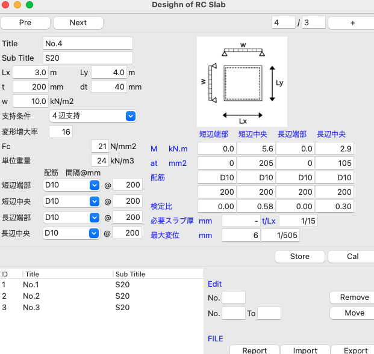
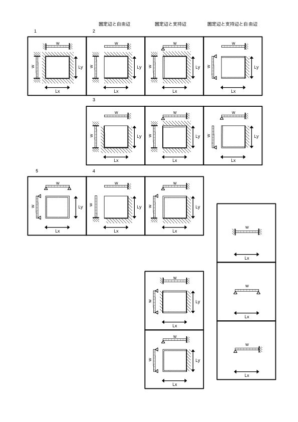

# twoWaySlab

## Features
- Calculate deflection and stress of the two way RC slab
- Solve plate eq. directly by the method of Dr.Higashi



## Souce
### rcSlab.py
 Main Program
### aijRc.py
 Propeties of the reinforcement in japanese code.
### makereport.py
 Making pdf report by repotlab module
### Higashi.py
 Calculation of the two way plate

## Develop Memo

 長方形版の応力は、設計実務においては主要な境界条件に対して、無次元化した数値表が用意されており、その値を用いて応力、変形を推定する事が通例となっています。既存の数値計算ソフトウェアはこの数値表を利用し、内外挿する事により求めているのが多いです。

 本プログラムは、Poisson-Kirchhoffの薄板理論で支配される偏微分方程式を東博士によって考案された境地値で表された長方形平板の基本解を利用し、板内の撓み、及び応力を直接求めているところに、他のソフトウェアとは異なる特徴があります。

 コードはPythonによって記述しました。算定にあたり、以下の手法をとっています。

- ２方向長方形板の応力を有限フーリエ変換を用いた解を利用し、直接求めたものです。
- 解の誘導は、”建築構造学体系11、平板構造、東洋一ほか”を参照してください。
- 文献で求められている数式には一部誤記があるため、適宜修正しています。
- 未定乗数を求める連立方程式はnumpyモジュールを利用して解きました。
- 撓み関数から板内の応力は、開発スピードを優先し、sympyモジュールを利用して導関数を直接求めました。
- この時、級数の打ち切りは5としました。
- 計算プログラムはクラスとして定義し、クラスの名前はHigashiとなっています。

## Higashi.py

### how to
``` python
obj = Higashi()
obj.solve(Id_bound,lx,ly,t,w,creep,ec,nu,nmax,mmax)
```
### input parameter
- Id_bound: Boundary condition (1-5)

- lx,ly: Shorter & Longer span (m)
- t: Slab thickness (mm)
- w: distributed load (kN/m2)
- creep: Creep Factore (16)
- nu : Poisson's ratio (-)
- nmax, mmax : Num. of the Fourier series (-)
### return
- by list = [Mx1, Mx2, My1, My2, dv]
- Mx1: Negative Momend at Ext. End for the shorter span
- Mx2: Positive Moment at Cent. for the shorter span
- My1: Negative Momend at Ext. End for the longer span
- My2: Positive Moment at Cent. for the longer span


## Module
- numpy
- sympy
- pandas
- reportlab
